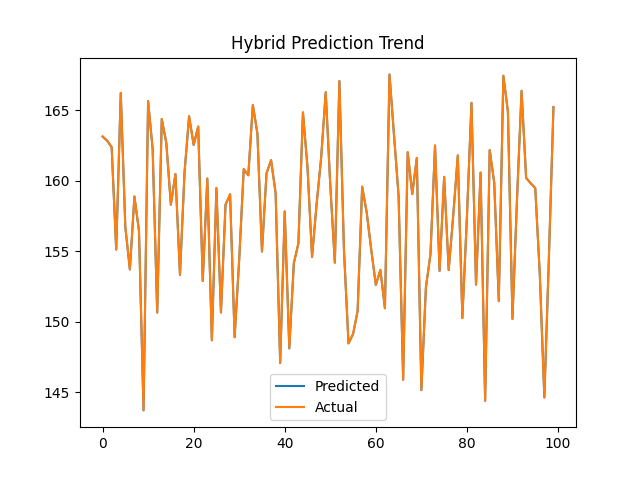

🚗🌳 Smart Parking Shade Optimization System
Hybrid PSO + WOA Based Urban Heat Mitigation
📌 Project Overview

Urban parking areas significantly contribute to the Urban Heat Island (UHI) effect due to large asphalt surfaces and prolonged vehicle exposure to solar radiation.
This project presents an AI-driven Smart Parking Shade Optimization System that predicts shade requirement intensity and optimizes shading strategies using a hybrid Particle Swarm Optimization (PSO) and Whale Optimization Algorithm (WOA).

The system integrates deep learning (CNN) with bio-inspired optimization techniques to support climate-adaptive urban planning.

🎯 Objectives

Predict parking shade requirement using meteorological data

Learn complex environmental patterns via Convolutional Neural Networks

Optimize shade placement parameters using PSO → WOA hybrid optimization

Generate visual analytics, structured outputs, and deployment-ready models

🧠 System Architecture
Meteorological Data
        ↓
Feature Engineering
        ↓
CNN Prediction Model
        ↓
PSO Optimization
        ↓
WOA Refinement
        ↓
Optimal Shade Strategy

📂 Dataset Used

The system uses historical city-wise weather data, including:

Temperature

Humidity

Pressure

Wind Speed

Wind Direction

Input Files (CSV)

Located in:

archive/

File Name	Description
temperature.csv	Hourly city-wise temperature
humidity.csv	Relative humidity
pressure.csv	Atmospheric pressure
wind_speed.csv	Wind speed
wind_direction.csv	Wind direction
city_attributes.csv	City metadata
⚙️ Feature Engineering

A composite Shade Need Index (SNI) is derived:

shade_need_index =
  (0.5 × Temperature)
+ (0.2 × Humidity)
- (0.3 × Wind Speed)

This index serves as the prediction target.

🤖 Machine Learning Model
CNN Configuration

Input: 5 meteorological features

Layers:

Conv1D (32 filters)

Conv1D (64 filters)

Dense (64 neurons)

Output layer (regression)

Loss Function: Mean Squared Error (MSE)

Optimizer: Adam

Early Stopping enabled

🧬 Hybrid Optimization Strategy
1️⃣ Particle Swarm Optimization (PSO)

Performs global exploration

Identifies promising candidate solutions

2️⃣ Whale Optimization Algorithm (WOA)

Refines PSO output using:

Encircling prey behavior

Bubble-net attacking strategy

Improves convergence and stability

✅ Final Hybrid: PSO → WOA
📊 Outputs Generated (All with poa_ Prefix)
📁 Saved Files
File	Description
poa_parking_shade_model.h5	Trained CNN model
poa_parking_shade_objects.pkl	Scaler + optimization results
poa_parking_shade_config.yaml	Configuration metadata
poa_parking_shade_results.csv	Actual vs Predicted vs Error
poa_parking_shade_predictions.json	Metrics & predictions
📈 Visualizations
Graph	Purpose
poa_accuracy_loss.png	Training vs validation loss
poa_comparison_graph.png	Actual vs predicted values
poa_heatmap.png	Feature correlation
poa_error_distribution.png	Prediction error spread
poa_prediction_graph.png	Time-series prediction trend

All graphs are displayed on screen and saved automatically.

🧪 Evaluation Metrics

Mean Squared Error (MSE)

R² Score

Error Distribution Analysis

These metrics are exported in CSV and JSON formats.

🛠️ Tech Stack

Python 3.11

TensorFlow / Keras

Scikit-learn

NumPy, Pandas

Matplotlib, Seaborn

Bio-inspired Optimization Algorithms

🚀 How to Run

Place datasets inside:

Parking Shade Optimization System/archive/

Install dependencies:

pip install tensorflow numpy pandas scikit-learn matplotlib seaborn pyyaml

Run the script:

python hybrid_pso_woa_parking_shade.py

Outputs will be generated automatically in:

Parking Shade Optimization System/

🌍 Use Cases

Urban heat island mitigation

Smart city infrastructure planning

Sustainable parking design

Climate-resilient urban development

Decision support for municipal authorities

🔮 Future Enhancements

GIS-based shaded parking layout maps

Real-time IoT sensor integration

Reinforcement learning for dynamic shade control

Comparative benchmarking of multiple hybrids

Web dashboard for city planners

👨‍💻 Author

Sagnik Patra
AI & Machine Learning Researcher
Focus Areas:

Smart Cities

Climate AI

Hybrid Optimization Algorithms
